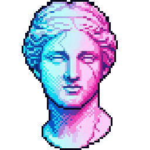
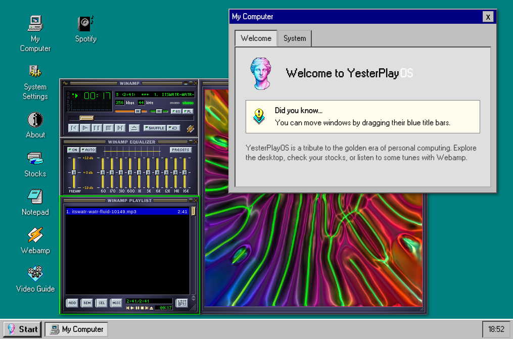

#  YesterPlayOS

YesterPlayOS is a lightweight, frontend-only web application that simulates a classic Windows 95-inspired desktop interface. It provides a nostalgic and highly configurable environment with windows, a taskbar, a Start menu, and various built-in utilities.

## Features
- **Nostalgic UI:** Authentic Windows 95 aesthetic with classic colors, fonts, and window decorations.
- **Window Management:** Draggable and resizable windows with z-index management and focus handling.
- **Taskbar & Start Menu:** Functional taskbar with a clock and a Start menu for launching applications.
- **Pure Frontend:** Built with vanilla HTML, CSS, and JavaScript—no external frameworks required.
- **Highly Configurable:** Easily customize shortcuts, icons, and window content through a central `config.json` file.
- **Cross-Platform:** Supports both desktop and mobile browsers with touch interaction support.
- **Persistence:** Uses browser session and local storage for settings and application state (like Notepad content).

## Pre-built Utilities
- **My Computer:** View system information (platform, browser, resolution) and discover helpful tips.
- **System Settings:** Customize your desktop background URL and the global window title.
- **Notepad:** A functional text editor with file opening/saving capabilities and real-time cross-window synchronization.
- **Webamp:** A classic Winamp-style music player ([Webamp](https://webamp.org/)).
- **Stocks:** A retro-themed terminal for tracking simulated market data.
- **Video Guide:** An embedded YouTube player for tutorials or guides.
- **Spotify:** Integration for playing Spotify playlists directly within the OS.

## Customization via `config.json`
The desktop environment is driven by `yesterplay/config.json`. You can modify this file to change the global OS settings or add/remove shortcuts.

### Global Options
- `desktop.background`: The default background image URL or CSS color.
- `desktop.title`: The title displayed in the browser tab.

### Shortcut Configuration Options
Each entry in the `shortcuts` array supports the following properties:

| Property | Type | Required | Description |
| :--- | :--- | :--- | :--- |
| `name` | string | Yes | The display name of the shortcut and window title. |
| `icon` | string | Yes | Path to the `.png` icon file. |
| `content` | string | Yes | The HTML content or JavaScript code for the application. |
| `enabled` | boolean | No | Whether the shortcut is active and visible (default: `true`). |
| `autostart` | boolean | No | Whether the app opens automatically on startup (default: `false`). |
| `js_only` | boolean | No | If true, executes the content as a JavaScript module without opening a window (default: `false`). |

## License
The source code for YesterPlayOS is licensed under the **MIT License**.
